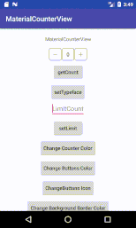

# MaterialCounterView
[](https://jitpack.io/#BasetEsmaeili/MaterialCounterView)

a Android Library for counting anything





# How to Download
**Gradle**

**Step 1:**
add below code in your root build.gradle at the end of repositories:
```gradle
allprojects {
		repositories {
			...
			maven { url 'https://jitpack.io' }
		}
	}
```
**Step 2:**
add below code in build.gradle dependency of app module
```gradle
dependencies {
	        implementation 'com.github.BasetEsmaeili:MaterialCounterView:0.1.0'
	}
```
# How use this library

**XML**
```xml
<com.baset.mcounterview.MaterialCounterView
    android:id="@+id/myCounterView"
    android:layout_width="wrap_content"
    android:layout_height="wrap_content"/>
```
1- change add Button Icon
```xml
app:addButtonDrawable="@drawable/ic_arrow_forward_black_24dp"
```
2- change remove Button Icon
```xml
app:removeButtonDrawable="@drawable/ic_arrow_back_black_24dp"
```
3- change Buttons Icon Color
```xml
app:buttonsDrawableColor="@color/colorPrimary"
```
4- change count value Color
```xml
app:countTextColor="@color/colorAccent"
```
5- change background stroke color
```xml
app:roundBtnBackgroundColor="@color/colorPrimaryDark"
```
**Java or Kotlin**

**Step 1:**
findViewById
```kotlin
val myCounterView:MaterialCounterView=findViewById(R.id.myCounterView)
```
**Step 2:**

Customization

1-this method return count
```kotlin
myCounterView.count
```
2-this method setFont on View
```kotlin
myCounterView.setTypeface(typeface)
```
3- this methods change Buttons Icon
```kotlin
myCounterView.setAddButtonDrawable(ContextCompat.getDrawable(baseContext,R.drawable.ic_arrow_forward_black_24dp))
myCounterView.setRemoveButtonDrawable(ContextCompat.getDrawable(baseContext,R.drawable.ic_arrow_back_black_24dp))
```
4- this method change Buttons Icon Color
```kotlin
myCounterView.setButtonsDrawableColor(ContextCompat.getColor(baseContext,R.color.colorPrimaryDark))
```
5- this method change Count Value Color
```kotlin
myCounterView.setCountTextColor(ContextCompat.getColor(baseContext,R.color.colorAccent))
```
6- this method set limit for counting
```kotlin
myCounterView.setMaxCount(10)
```
7- this method change background stroke color
```kotlin
myCounterView.setRoundBtnsBackgroundColor(ContextCompat.getColor(baseContext,android.R.color.white))
```
# Licence
Copyright 2018 Baset Esmaeili

Licensed under the Apache License, Version 2.0 (the "License"); you may not use this file except in compliance with the License. You may obtain a copy of the License at
```text
http://www.apache.org/licenses/LICENSE-2.0
```
Unless required by applicable law or agreed to in writing, software distributed under the License is distributed on an "AS IS" BASIS, WITHOUT WARRANTIES OR CONDITIONS OF ANY KIND, either express or implied. See the License for the specific language governing permissions and limitations under the License.

# Author

**Baset Esmaeili**

email: baset.esmaili0@gmail.com

telegram: https://telegram.me/ikurdish
